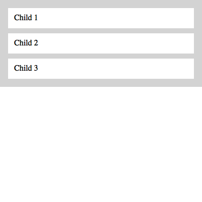
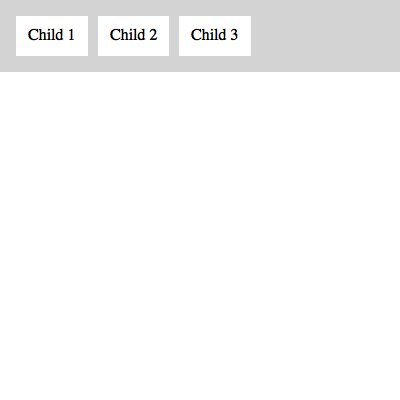
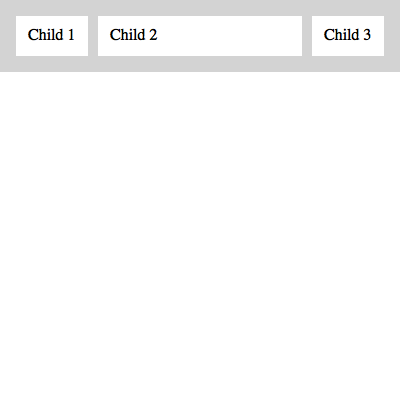

# React Boxen
A layout primitive for React.

React Boxen utilizes [Styled Components](https://styled-components.com) to provide cross-browser layout.

## Why?

- **Flex Box Plus** - Provides a helpful layer of abstraction on top of the robust (and sometimes confusing) display flex properties
- **Child spacing** - Provides consistent spacing between child elements vertically, horizontally, and wrapping

## Installation

`npm install react-boxen --save` _or_ `yarn add react-boxen`

## Usage Examples

### Spacing vertically

This example produces a layout with each child spaced vertically.



```jsx
import React from "react"
import Box from "react-boxen"

const css = {
  parent: `
    padding: 1em;
    background: lightgray;
  `,
  child: `
    padding: 0.75em;
    background: white;
  `
}

export default () =>
  <Box
    css={css.parent}
    childSpacing="10px">
    <Box css={css.child}>Child 1</Box>
    <Box css={css.child}>Child 2</Box>
    <Box css={css.child}>Child 3</Box>
  </Box>
```

### Spacing horizontally

This example produces a layout with each child spaced horizontally.



```jsx
import React from "react"
import Box from "react-boxen"

const css = {
  parent: `
    padding: 1em;
    background: lightgray;
  `,
  child: `
    padding: 0.75em;
    background: white;
  `
}

export default () =>
  <Box
    css={css.parent}
    childDirection="row"
    childSpacing="10px">
    <Box css={css.child}>Child 1</Box>
    <Box css={css.child}>Child 2</Box>
    <Box css={css.child}>Child 3</Box>
  </Box>
```

### Child grow

When a child receives `grow` as a prop (or `data-grow` for native elements) it fills the available space.



```jsx
import React from "react"
import Box from "react-boxen"

const css = {
  parent: `
    padding: 1em;
    background: lightgray;
  `,
  child: `
    padding: 0.75em;
    background: white;
  `
}

export default () =>
  <Box
    css={css.parent}
    childDirection="row"
    childSpacing="10px">
    <Box css={css.child}>Child 1</Box>
    <Box grow css={css.child}>Child 2</Box>
    <Box css={css.child}>Child 3</Box>
  </Box>
```

## API

### Box Properties

Properties placed on the Box component directly.

Property               | Type   | Value _(default `*`)_                                             | Description
---                    | ---    | ---                                                               | ---        
`css`                  | String | Template literal containing valid CSS                             | See [styled-components documentation](https://github.com/styled-components/styled-components#passed-props)
`childAlign`           | String | `flex-start *` `flex-end` `center` `stretch` `baseline`           | Align children along the cross axis
`childBasis`           | String | Length                                                            | Assigns flex-basis on children
`childDirection`       | String | `column *` `column-reverse` `row` `row-reverse`                   | Vertical or horizontal orientation of children
`childJustify`         | String | `flex-start *` `flex-end` `center` `space-between` `space-around` | Align children along the main axis
`childWrap`            | String | `nowrap *` `wrap` `wrap-reverse`                                  | Define whether or not children can wrap
`childWrapLastGrow`    | Bool   | `True *`                                                          | Setting to `false` preserves any orphan element's width when `childWrap` is `wrap`.
`childSpacing`         | String | Length                                                            | Spacing between children on any axis (accepts shorthand value `5px 10em`)
`padding`              | String | Length                                                            | Accepts shorthand `5px 10em`
`...rest`              | Any    | Any                                                               | Rest of props (aside from `children`) are spread onto `Box` itself (e.g. `onClick`, `onPress`, etc.)

### Child Properties

Properties added to any direct child. For compound components use values as shown. For native elements (e.g. `<div />`) use `data-<grow|shrink|...>` (i.e. `<div data-grow>Child</div>`).

Property               | Type   | Value _(default `*`)_                                             | Description
---                    | ---    | ---                                                               | ---        
`basis`                | String | Length                                                            | Individual flex-basis. This controls the length (width or height) along the main axis.
`grow`                 | Number | `0 *`                                                             | Amount `Box` should grow to fill available space
`scroll`               | Bool   | `False *`                                                         | Sets child wrapper to 100% height and overflow auto
`shrink`               | Number | `0 *`                                                             | Amount `Box` should shrink inside available space

## Roadmap

Technically, there is nothing preventing usage with React Native. The web is a more immediate proving ground. As the API solidifies, testing and support will be hammered out for RN. PRs are always welcome!
